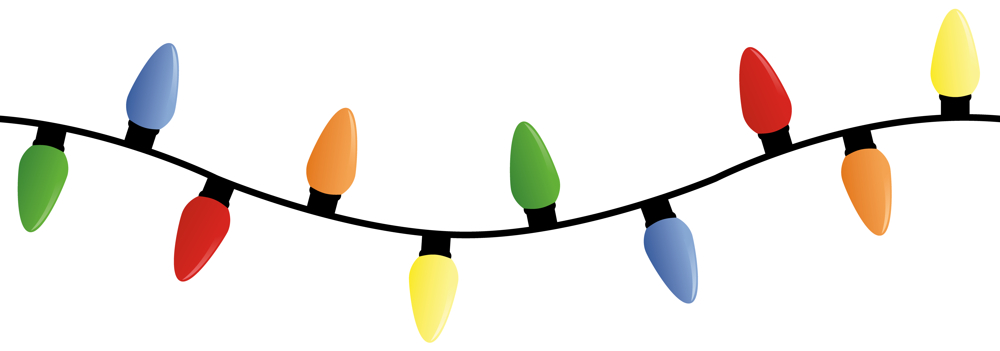

# HEY RACHEL! #
# MERRY CHRISTMAS! #
Sorry I forgot to mail this in time. . . .  I'm very bad.  I hope you can
find it in your heart to forgive me.  Enjoy :)

Check [this](/for_rachel.html) out!

# Everybody else: #
Hi there!

My name is Kyle Wenholz, and this is my attempt at a website representing
myself.  I hope you enjoy your stay.

I currently study Mathematics and (two degrees yeah!) Computer Science at
[University of Puget Sound](http://pugetsound.edu), in the lovely city of Tacoma,
Washington.  This year, I'll be finishing up my coursework to graduate in
May, all whilst fending off the vicious local wildlife.

## Current Projects ##
* Finish an Honors Senior Thesis on my Support Vector Machine for the timeliness of the ferry system.
* Continue developing [LendingShack](http://www.lendingshack.com)! (With the
help of my great friend and colleague, Josef Lange.)
* Graduate, and get a job I would be thrilled to talk about with my non-technical
grandmother.  (She's an awesome sounding board.)

## My Posts (however few they may be) ##

<ul class="posts">
  
    <li>{{ post.date | date_to_string }} &raquo; <a href="{{ BASE_PATH }}{{ post.url }}">{{ post.title }}</a></li>
  
</ul>

